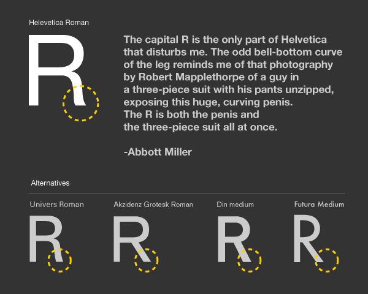
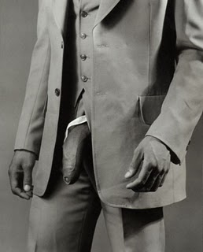
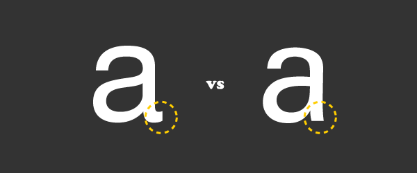

Lars Muller 출판사에서 나온 Helvetica : Homage to a Typeface를 보면
들어가있는 작품들도 좋지만 책 밑부분에 하나씩 실려있는 자투리 글이 더 재미있다.
헬베티카에 관한 의견을 피력한 짧은 글들인데, 찬양도 있고 비난도 있다.
(데이빗 카슨은 여기서 이런 글을 남긴다.
<em>'If you have no intuitive sense of design, then call yourself an
'information architect' and only use helvetica.'</em>
일종의 비난이라고 보는데. 암튼 나한테 하는 얘기인 것 같기도 하고 흠.
'no intuitive sense of design' ㅠㅠ...
하지만 타입에 전혀 관심 없는 사람들이 생각하기 귀찮을 때 쓰는 서체가 헬베티카라면
디자이너의 입지는 상당히 좁아질 것이라는 생각은 든다)
그 중 Abbott Miller라는 사람이 남긴 글이 약간 불경스러우면서도 재미있다.
헬베티카의 대문자 R에 관한 내용.

<em>The capital R is the only part of Helvetica that disturbs me.</em>

<em>The odd bell-bottom curve of the leg reminds me of that photography by Robert Mapplethorpe</em>

<em>of a guy in a three-piece suit with his pants unzipped, exposing this huge, curving penis.</em>

<em>The R is both the penis and the three-piece suit all at once.</em>

대문자 R의 밑부분이 심히 신경쓰인다는 말..

여기서 이 사람이 말한 사진은 이것.. (난 잘 모르지만 Robert Mapplethorpe는 상당히 유명한 사진작가인듯)

<strong>Robert Mapplethorpe</strong>, "Man in Polyester <strong>Suit</strong>," 1980.

헬베티카를 보고 이 사진을 떠올리다니. 관찰력이 놀랍다고 해야하나 ㅎ. 일면 수긍..이 가기도 하지만.

이게  싫다면 그 대안으로 조금은 덜 꺾인 유니버스를 쓸 수 있겠으나

아마 충분한 대안은 안될거라는 생각이 든다. 여전히 미묘한 커브..

그렇다면 악치덴트 그로테스크나 Din처럼 시원스럽게 다리를 편 쪽을 선택해야하는 것일까.

(윤고딕 영문도 이렇게 생겼다)

하지만 이것도 가끔은 둥근 부분과 다리 부분의 공간이 넓어지면서 종종 (특히 크게 썼을때)

허전하고 비어보이는 느낌을 주는데... 아마도 헬베티카처럼 굽어져서 시작해서 끝은

아래를 향해 직각으로 뻗은 R를 써야할 것 같다.

하지만 이건 또 왠지 약간의 '싼티'를 동반한다. 무성의해보인달까.

미묘한 곡선 디테일에서 오는 품위로 볼 것인지

어떤 사진작가의 그로테스크한 사진을 떠올리게 하는 촉매인지

흠. 뭐 그 사진을 본 사람이 잘못인가

개인적으로 이런 생각 (타입의 특정 글자가 자꾸 신경쓰인다는)을 한 적이 있는데 나의 경우에는

헬베티카의 소문자 a였다.

헬베티카와 유니버스를 만난지 얼마 안되었을때

(한마디로 둘의 차이점을 찾기 위해 글자들을 확대해서 보던 때)

저 a끄트머리가 너무나 거슬렸다. 저것 때문에 거의 항상 유니버스가 나의 선택을 받았다.

(그래봐야 '장난감'이 될 뿐이었지만..)

하지만 또 어떤 순간 이후로는 (별다른 이유도 없이) 저 꼭지가 멋있어 보이면서

유니버스의 a가 또 허전해보이고 오른쪽으로 기울어져 넘어질 것 같다는 불안감에 휩싸인다.

당연히 헬베티카가 한동안 장난감의 위치를 확보.

저 꼭지가 볼드부터 사라진다는 것에 아쉬워했었다.

지금은?

그냥 저런건 약 95%의 사람들이 신경도 안쓸거라는 사실에 안도하며

'그때 그때 달라요'라고 생각한다.
