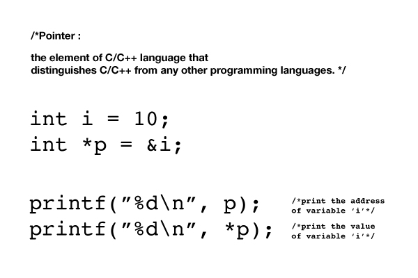

앞으로 차차 알게 되겠지만..

C책을 산 김에 궁금하던 pointer장부터 조금 읽어보았다.

포인터도 일종의 변수이고, 조금 의미가 다르긴 하겠지만 일종의 데이터 타입이라고도 볼 수 있겠다.

이 변수안에는 '주소'가 들어간다.

그리고 주소를 제공하는 원 변수와 같은 데이터 타입으로 선언해야한다.
<pre><code>
#include <stdio.h>

int main(void) {
    int i = 10;
    int *p = &i;
}
</code></pre>

&이 변수 앞에 붙으면 그 변수가 차지하고 있는 메모리의 주소를 반환한다.
이 주소를 포인터에 넣어주면, 이 포인터는 해당 변수의 '위치'를 가지게 되고,
진짜 변수를 꺼내는 대신 이 주소를 가지고 이것 저것 할 수 있다.. (간접참조)는 것인데..
개념은 대략 이해가 가지만 이걸 왜 써야하는지는 좀 더 읽어봐야 알 수 있을 것 같다.
솔직히 int타입 변수가 차지하는 메모리나 int포인터 변수가 차지하는 메모리나
그게 그거 같은데.
하지만 결국 나중엔 거대한 데이터를 처리할테고, 그걸 왔다리 갔다리 하는 것 보단
주소만 가지고 처리하는게 훨씬 빠르게 되는 날이 오지 않을까 예측할 뿐.
음.. 비유를 하자면
집을 사고 팔때 집을 직접 들고가서 돈하고 바꾸는 게 아니라
집은 그냥 그 자리에 두고 그 집을 가리키는 등기만 가지고 거래하는 느낌?
2000페이지짜리 책을 들고다니기는 힘드니까
도서관에서 그 책 위치만 적고 필요할 때마다 가서 보는 느낌?
