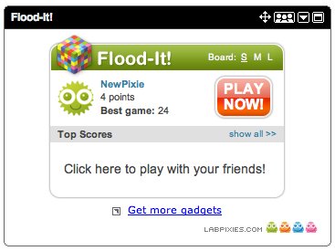
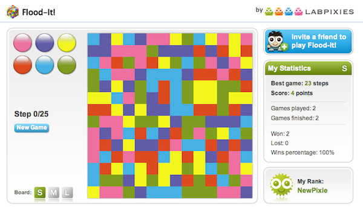

구글이 이스라엘 게임회사인 LabPixies라는 회사를 꽤 거액에 인수했다는 소식을 듣고

이 회사의 대표작이라는 Flood-it!이라는 게임을 해보았다.

오랜만에 만나는 간단하고 중독성있는 퍼즐게임. 난 환호했다.

스도쿠도 한참 빠져서 열심히 했었는데 (결코 잘 할 수는 없다).

페이스북 팜빌도 하다가 문득 상해가고있을 포도들을 너무나 걱정하는 내 모습을 보고

내가 뭐하고 있나 싶어서 그만 둔지 한달째.. 새로운 게임을 만난 것이다.

한판으로 깔끔하게 끝나는 데다가 시간제한같은 것도 없어서

속도감있는 게임을 싫어하는 나에게 잘 맞는다. (스도쿠도 시계가 너무 신경쓰였다)

iGoogle Gadget에서 무료로 추가해서 할 수 있고,

돈은 주로 iPhone, Android 어플로 번다고 하기에 일단 구글에서 해보았다.

몇 판 재미나게 하다가, 아차, 페이스북에도 있다그랬지.. 하는 생각에 바로 페북으로 넘어갔다.

iGoogle에서 할 때는 재미는 있었지만, 남들한테 추천하기도 뭐하고 쓸쓸한 느낌을 받았는데

페이스북에서 할 때는 포스팅을 통해서 홍보도 하고 내 기록을 공유할 수 있다는 사실만으로도

이 정적인 게임이 훨씬 따뜻하게 느껴지는 것을 보며

플랫폼의 위력을 새삼 실감했다. 기록을 공유하는 것이 이토록 다른 감성을 가져온다니.

(아이폰이나 안드로이드폰이 있었다면 바로 받아서 했겠지 ㅠㅠ)

게임 룰은 간단하다. 시작은 최좌상단 픽셀부터 시작한다. 위 화면과 같은 경우,

일단 파란색을 선택해서 파란색과 연합하고.. 그 다음수를 고민하다가 핑크를 선택해서

핑크까지 영역을 확장하고.. 그런식으로 화면의 모든 픽셀을 같은 색으로 맞추면 끝난다.

위와 같은 작은 사이즈의 경우에는 25번 안에 모든 픽셀의 색을 맞추어야하고

성공하면 이기고, 실패하면 진다.

25번안에 맞추면 1점, 24번안에 맞추면 2점 이런식으로 포인트가 매겨진다.

하나하나 색을 선택할때마다 고민이 깊어진다.

아- 재밌다. 나도 빨리 이런 좋은 게임 하나 만들어서 구글에 인수당하고 싶다는 생각을 하며...
