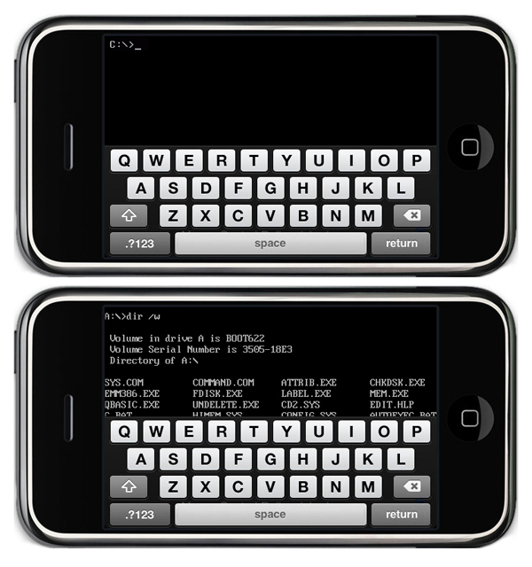

갑자기, 이런 이미지가 떠오른다.

MS-DOS를 배우던 시절, 컴퓨터는 '배운 자'들을 위한 것이었다 철저히.
(물론 이전에 비하면 많이 친절해진 것이었겠지만)
명령어를 모르면 하염없이 깜빡이는 커서만 바라봐야 했던 때.

GUI가 등장하면서 일단, '뭔가가 움직인다'는 피드백을 쉽게 받게 되면서
컴퓨터는 좀 쉬워졌다. 컴퓨터 전원누르기가 두려운 이들도 지뢰찾기나 카드게임은
할 수 있었다.

터치 인터페이스가 등장하고 나니 4~5살 꼬마도 컴퓨터를 한다.
이제 건드리기만 해도 뭔가 막 된다.

점점 쉬워진다. 사용자 친화의 이름 아래.
예전에는 프로그램 하나를 쓸때 '배울 생각'부터 했다.
특정 기능, 메뉴를 찾는건 사용자의 '임무'였다.
이제 스마트폰 어플 메뉴에서 뭐 하나만 찾기 힘들어도
'프로그램'이 잘못되었다고 불평한다.
안배워도 바로 쓸수 있는 '직관성'이 이제
프로그램의 임무이다.

Command Line Interface를 가진 디바이스?
이젠 상상할 수 없다.
다 예쁘게 쉽게 재밌게 꾸며주고
사용자에게 떠먹여줘야 좋은 인터페이스.
