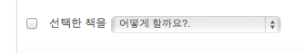

개인적으로 [유저스토리북](http://userstorybook.net)이라는 서비스를 참 좋아한다.

평소에 책을 많이 읽는 건 아니지만, 뭔가 읽은 책이나 산 책을 기록하기에 좋은 서비스이기 때문이기도 하고, 디자인도 마음에 들고. (안드로이드용 앱을 좀처럼 내놓지 않는다는게 제일 불만...)

그리고 소소한데서 감동을 주는면이 없지않아서 더 좋다.

피드백도 잘 주고받고.

그러는 중, 뭔가 레이블링 센스가 돋보이는 부분이 있어서 캡쳐해본다.  
'책장정리'라는 기능에서 '선택한 것들'처리하는 부분인데  
이런데서는 보통 '삭제', '이동'과 같이 짤막한 단어를 쓰는게 보통인데,

'어떻게 할까요?' 부터 시작해서 상당히 따뜻하게 풀어서 써놓았다.

전반적으로 서비스가 '친절한'느낌을 많이 주는데, 이런데서도 드러나는 듯...

설계나 UI에 대한 In-depth Interview를 해보면 실제로  
사용성이슈가 제일 많이 나는 부분은 뭔가 멋지지 못한 GUI보다는  
잘못된, 혹은 공급자 중심의 레이블링인 경우가 많다.  
  
회사 사람들 끼리만 알아들을만한 단어를 쓰거나  
(혹은 회사 사람들도 잘 모르는 단어를 쓰거나;)  
너무 전문적인 용어를 해설도 없이 쓰거나  
(아니면 어려운 용어를 줄줄이 써놓고 그에 대한 설명 주석을 주렁주렁 달아놓거나)  
직관적이지 않은 말들을 쓰거나  
쓸데없이 설명이 길어지거나 하는 것들..

그런 것들이 많은 오해를 일으키고, 사용자들을 수렁으로 빠뜨리는 경우가 많았다.

근데 그게 그냥 '안일함'에서만 나오는건 아니고  
실제로 레이블링은 정말 머리터질 정도로 어려운 일이다.  
이렇게 쓰면 알까? 이걸 뭐라고 하지?  
그래서 항상 문제점 지적은 쉬운데..  
레이블링에 대한 제안이 참 어렵다.  
탭 이름을 짓는것이나, 버튼 이름을 짓는 것이나...  
  
머 감동받은걸 쓰려다가 푸념으로 끝나가는 글...

아무튼 결론은, 유저스토리북은 어서 안드로이드앱을 출시하라.  
스캔하면 바로 서재에 넣게 해달라! 
