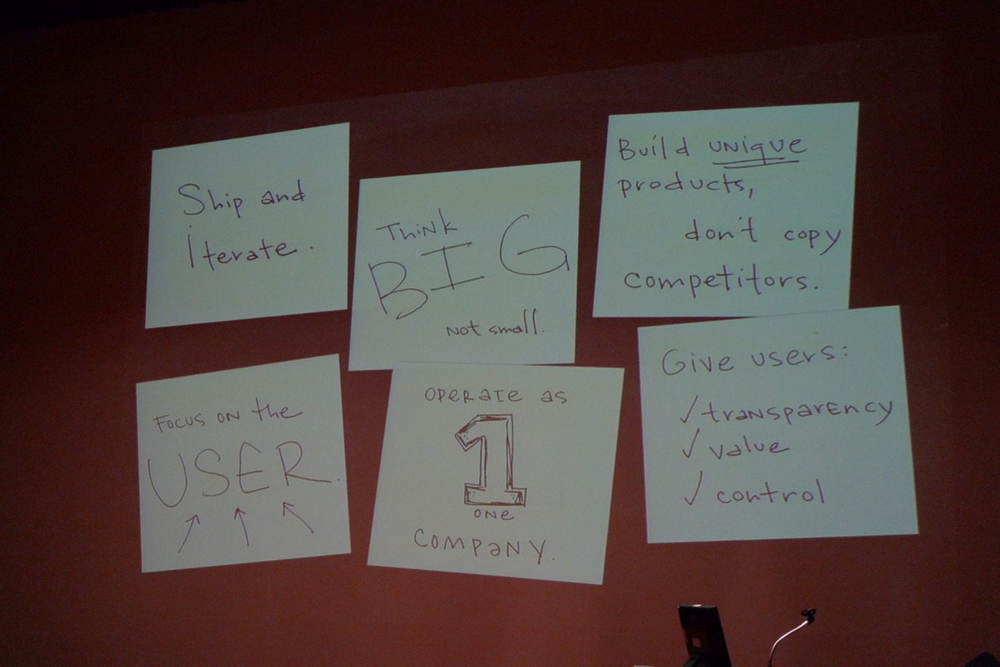

2012 HCI학회에 대한 단상 (2)

Ed. H. Chi 박사가 자랑한 구글의 원칙.  

Think Big, not Small.  
구글의 상대는 정말 '크다'. 1억 5천만의 인터넷 인구가 그들의 대상이다.  
그래서 10명, 20명, 30명 만나서는 알 수가 없댄다.  
그래서 거대한 데이터 분석을 해야한다고 한다.

제록스 PARC에서 구글로 옮긴 가장 큰 이유는  
'여기엔 DATA가 많기 때문'이라고 했다.

잘났다 쳇 ㅠㅠ
