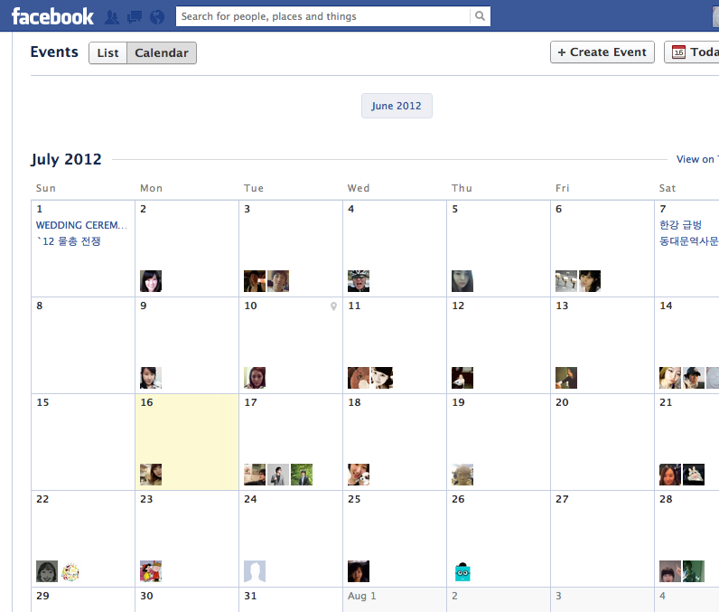

지난 12일에 페이스북의 Events 인터페이스에 '캘린더' 형태가 도입되었다. 잘하면 Google Calendar의 가장 강력한 적수가 되지 않을랑가 싶다.

Google Calendar는 캘린더 앱 중에서는 의심할 여지없이 최고지만 (그렇다고 개인적으로 생각하고 있다) 공용 캘린더에 '친구'를 초대하는 과정엔 여전히 어려움과 불쾌함이 있다. 무엇보다도 상대의 '이름'이 아닌 '이메일'을 알아야 한다는게 제일 큰 장벽이다. 모두가 느끼고 있으리라 생각되지만, 누군가의 이메일을 모으는건 정말로 짜증나는 일이다. 설령 내 주소록에 저장되어있다고 해도, 그 이메일을 아직까지 쓰고 있는지, 주메일인지 아니면 그냥 정크메일함인지, 평소에 메일을 확인하긴 하는지 알아봐야 하는 수고는 남아있다. 게다가 이 경우에는 상대가 Gmail을 써야만 한다는 전제까지 달려있으니... (사실 구글 캘린더 초대할 때 상대 이메일이 반드시 Gmail이어야 하는지 아닌지 아직도 정확히 모르겠다. 그래서 항상 Gmail을 달라고 한다) 구글 캘린더에서 공용 캘린더나 이벤트를 만드는건 상당히 큰맘을 먹어야 하는 일임에 틀림 없다.

물론 구글 캘린더에서 친구를 초대하는 Form은 매우 빠른 '자동완성'을 지원하기 때문에 주소록만 잘 갖추고 있다면 그렇게 힘든일은 아니지만, 친구를 주소록에 내 손으로 등록하는 것은 페이스북에서 친구를 추가하는 것과는 차원이 다른 일이다. (PC에서나 모바일에서나 주소록에 사람을 등록하고 전화번호와 이메일을 입력하는 건 왠만하면 정말 하고싶지 않은 일이다)

아직까지는 페북의 이벤트와 구글 캘린더의 영역이 겹치지는 않는 것 같다. 앞으로 이 두 개의 달력이 어떻게 쓰일지... 잘 관찰해봐야겠다.
