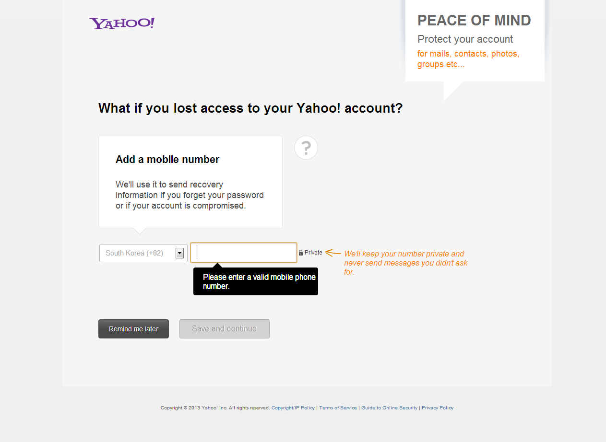

야후에 가입하고 두 번째 로그인할 때 나오는 화면.  
이런 페이지를 보면 이 회사가 잘 돌아가고 있구나라는 느낌이 든다. 정보 수집에 있어 지극히 '모범적인' 모습을 구현하고 있기 때문이다.

  * 가입 시 Form을 최소화하되 '점진적'으로 정보를 수집한다.
  * 정보를 모을 때는 그 이유를 명확히 한다.
  * 페이지를 구성할 때 몇 초 안에 사람을 움직일 수 있는 핵심 메시지를 가장 먼저 전달한다.
  * 개인 정보의 경우, 안심시키는 것도 중요하다.

이런 교과서적인 이야기들을 실무에서 구현하는 것은 매우 어려운 일이다. 그리고 야후는 하고있었다.

개인적으로 'What if you lost access to your Yahoo! account?'라는 메시지가 너무 훌륭하게 느껴진다. 무뚝뚝하게 수십줄의 약관을 들이밀면서 전화번호를 적는 폼을 세 개 뚫어놨다면, 난 별로 내 전화번호를 내놓고 싶지 않았을 것 같다. 하지만 저 짧은 한 문장 때문에 난 바로 전화번호를 내어주었다.

그래, 비번 까먹으면 어떻게해...
