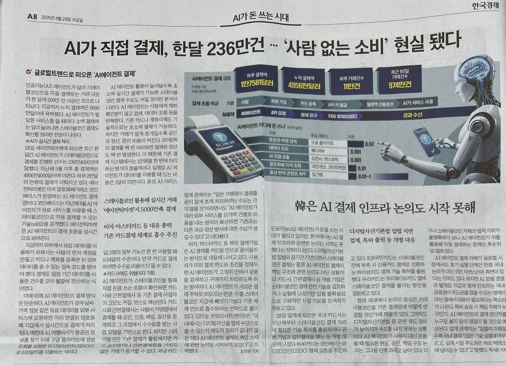
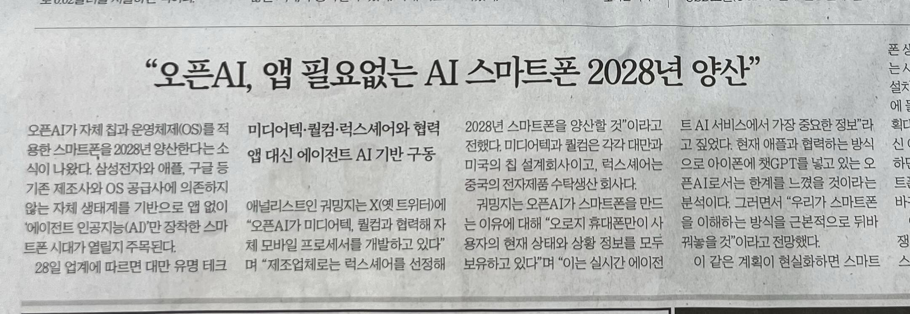

아이에게 뭘 사오라고 심부름을 시키려면, 돈이든 카드든 쥐어줘야 한다. 하지만 불안하다.

- 사오라는 것을 잘 사올까
- 자기 사고 싶은 걸 사지는 않을까
- 어디 딴 데로 새서 다른 데 돈을 쓰지는 않을까
- 나쁜 사람이 돈을 뺏지는 않을까

AI 에이전트에게 내 지갑을 쥐어주는 것도 비슷한 느낌이다. 하지만 쥐어줘야 심부름을 할 수 있다.

세상 어딘가에서 사람들이 용기를 내기 시작한 것 같다. 두렵지만, 내어줘야 AI가 할 수 있는 일이 많아진다.

괜찮다는 걸 몇 번 경험하고 나면 점점 더 큰돈을 맡기게 될 것이고, 결국 지갑을 챙기는 것조차 귀찮아하게 되겠지.

*사진은 오늘자 한국경제 신문.*

이게 원활하게 되려면 AI 에이전트끼리 돈을 주고받는 방식이 통일되어 있어야 한다. 카드를 들고 갔는데 현금만 받으면 곤란하니까.

그 '약속'을 만들기 시작했고, 업계에선 이런 약속을 프로토콜이라고 부른다. 이 프로토콜 이름이 x402.

코인베이스, 스트라이프, AWS, 그리고 한국에선 카카오페이가 이 약속을 만드는 데 참여하고 있다.

아주 높은 확률로 이 거래들은 암호화폐로 이뤄지게 될 거다. 암호화폐 지갑은 사람이 쓰긴 복잡해도, 컴퓨터가 쓰기엔 훨씬 좋기 때문이다.

이 기사 바로 아래에는, 오픈AI가 계획하고 있는 새로운 스마트폰 이야기가 나온다. 이걸 만들기 위해 샘 알트먼은 애플의 전설적인 디자이너 조나단 아이브를 데려왔다.

그때만 해도 '새로운 스마트폰이라니 말도 안 된다' 생각했지만, 지금은 다르다.

지금 스마트폰에는 서비스 제공자가 만든 '앱'을 설치한다. 쿠팡 앱, 배민 앱, 토스 앱을 설치한다.

하지만 그 앱이 하는 일을 대신 해줄 '에이전트'를 만든다면, 더 이상 앱을 설치할 필요가 없다.

내 폰에서 돌아가는 에이전트가 쿠팡 에이전트, 배민 에이전트, 토스 에이전트에게 일을 시키게 될 거고, 비용도 알아서 내게 된다.
