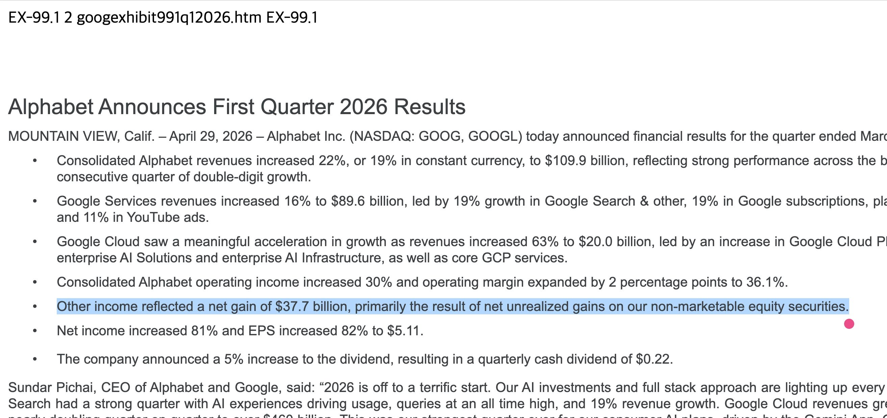
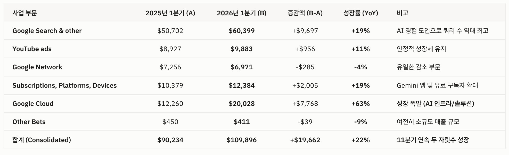

구글(알파벳)이 1분기 엄청난 실적을 발표했다. 기대가 컸는데도 그 기대를 넘어선 느낌? 특히 EPS(주당순이익)는 눈을 의심하게 만드는 수준이었다.

작년 1분기보다 81.9% 늘고, 증권사 추정치보다도 94.3% 높다. 추정치가 항상 맞는 건 아니지만, 이렇게까지 틀리는 경우는 없다.

그래서 EDGAR 공시 원문을 직접 읽어봤다. 그 비밀은 스페이스X와 앤스로픽(클로드)에 있었다.

EDGAR는 한국의 공시 시스템인 DART의 미국 버전이다. 모든 공시가 모이는 곳이고, 여기서 공시 원문을 볼 수 있다.

이번 발표의 순이익이 625.78억 달러인데, 그중 무려 377.16억 달러가 '기타 수익'이라는 것이다. 본업에서 번 게 아니라 다른 데서 생긴 수익이라는 것.

그리고 그 기타 수익의 상당 부분은 '비상장 지분 평가이익(Net unrealized gains on non-marketable equity securities)'이라는 내용이었다.

'비상장 지분 평가이익'은 뭘까?

말 그대로, '아직 상장 안 한 주식'이다. 상장을 아직 안 했기 때문에 주식 가격이 딱 얼마라고 말할 수 없고, 그래서 따로 '평가'를 한다. (평가 기준은 아주 다양하다.)

구글은 스페이스X와 앤스로픽에 대규모 투자를 해서 주식을 꽤 많이 가지고 있다고 알려져 있다. 그리고 두 회사 모두 올해 또는 내년에 상장 예정이고, 둘 다 가치가 천정부지로 치솟고 있는 중이다.

한마디로, 이번에 나온 '순이익' 중 절반 이상이 '주식 투자로 번 돈'인 셈이다.

내가 알파벳에 투자하는 이유 중 하나가 이 스페이스X와 앤스로픽 지분 때문이었다.

스페이스X 상장을 생각하면서 우주 산업 ETF도 사봤지만, 그 ETF에 들어 있는 종목들 중 상당수가 스페이스X와 경쟁하는 기업이라서 포기하고, 차라리 알파벳을 산 것도 있다.

반년쯤 전부터 클로드 코드를 쓰면서 앤스로픽에 꼭 투자해야겠다고 생각했는데, 직접 살 수 없어서 알파벳과 아마존에 투자한 것도 있다.

하지만 이게 얼마나 큰 영향을 미칠지는 알 수 없었다. 그게 이번에 숫자로 처음 보인 것 같다.

그럼 이번 알파벳 실적 서프라이즈는 다 주식 투자 때문이냐? 물론 그건 아니다. 본업 자체도 엄청나게 잘되었고, 특히 구글 클라우드 사업(GCP)이 말도 안 되는 성장을 달성했다.

우리 회사도 클라우드 서비스를 쓰지만, GCP는 3등 사업자고 엔지니어들에게 평가도 썩 좋지 않았다. (좀 만들다 만 것 같다고…) 서비스 퀄리티는 AWS가 압도적이다.

그런데 Gemini 모델을 써야 하는 회사들이 'AI 쪽 인프라는 구글 쓰자'는 결정을 많이 내린 것 같다. 이 흐름은 앞으로도 더 이어질 듯하다.

마지막으로, 이번 실적에서 사람들이 좋게 본 포인트 두 개 더.

- AI 서비스 때문에 구글 검색 실적이 악화되지 않을까 엄청 걱정했는데, 오히려 매출이 19%나 성장
- 좀 지지부진하다고 걱정받던 유튜브 광고도 11%로 좋은 성장

처음으로 공시 원문을 열어보고 살펴봤는데, 앞으로도 계속 보는 연습을 해야겠다. 끝-
