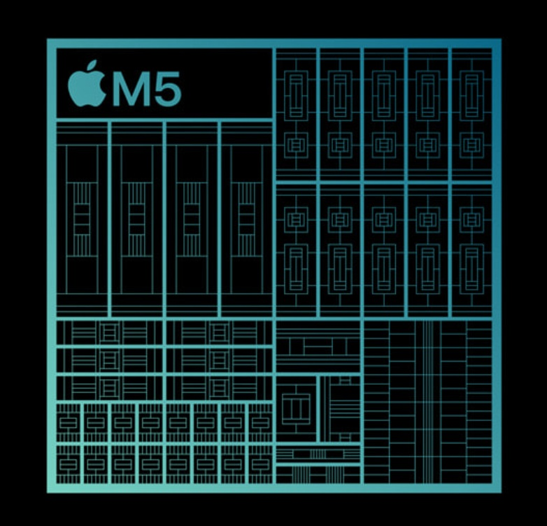

애플은 AI에서 뒤떨어져 있다는 인식이 많다.

구글처럼 프론티어 모델을 가지고 있는 것도 아니고, 시리와 애플 인텔리전스는 실망과 조롱의 대상이 되고 있고.

클로드 코드니 코덱스니 난리인데, 잠깐 멈춰서 생각해보면 다른 게 보인다.

'내가 읽을 뉴스를 요약하고, 오늘 장 볼 거 받아 적는 데 클로드 Opus 모델이 필요한가? 내 수면 정보를 분석하겠다고 이걸 샘 알트먼에게 넘겨줘도 괜찮은 걸까?'

지금은 대부분의 사람들이 AI를 쓴다고 하면 당연히 인터넷으로 저 멀리 어딘가에 있는 서버에 요청을 보낸다고 생각하지만, 꼭 그래야 할 필요는 없다.

내가 가진 기기에서 AI를 돌리는 것. 이게 '온디바이스 AI'다.

그리고 애플은 '어쩌다 보니' 이 온디바이스 AI 환경에서 상당한 우위를 가지게 되었다.

'애플 실리콘'과 'MLX 프레임워크' 덕이다.

전자는 어디선가 들어봤지만 그냥 그런가 보다 했을 것이고, 후자는 대부분의 사람들에게 낯선 말일 듯하다.

'애플 실리콘'은 애플이 2020년, 인텔과 결별하고 직접 만든 통합 칩 이름이다.

지금 쿠팡을 켜서 맥북을 검색해보면 M5니 M4니 하는 코드명이 나올 텐데, 이게 '어떤 애플 실리콘' 칩이 내장되어 있는지 말해주는 이름이다.

애플 실리콘 기반 맥은 2020년에 M1 맥북을 내놓으면서 세상에 나왔다.

애플 실리콘의 컨셉은 'CPU, GPU, NPU, 메모리를 여기저기서 사서 넣지 말고, 다 합쳐서 하나의 칩으로 만들자!'는 것이다.

CPU-GPU-메모리 사이에 데이터를 주고받을 때 전력도 많이 먹고 발열도 생기는데, 이게 맥북 같은 휴대용 기기에 치명적이었기 때문이다.

그런데 이 계획을 발표했을 때, 사람들의 반응은 차가웠다.

이유 1. '애플 실리콘'은 인텔의 'x86' 아키텍처를 버리고 'ARM' 아키텍처를 채택했다.

어려운 이야기이니 이게 일으킬 문제만 말하자면…

'기존 인텔 맥용으로 만든 프로그램들이 하나도 작동을 안 한다.'

모든 앱들을 애플 실리콘용으로 다시 만들어야 한다는 것이다. (지금도 맥용 앱을 다운로드받을 때 인텔이냐 애플 실리콘이냐를 물어보는 경우가 있는데, 이게 이 차이 때문이다.)

사람들은 불안에 휩싸였다. '새 맥을 사면 포토샵이고 뭐고 아무것도 안 켜지는 거 아냐?'

애플은 인텔용 앱도 돌아갈 수 있도록 하는 '로제타' 개발을 약속했지만, 사람들은 이게 잘 돌아갈 리가 없다며 불신했다.

이유 2. '통합 메모리' 구조.

기존 컴퓨터는 CPU가 쓰는 메모리(RAM)가 따로 있고, GPU가 쓰는 메모리(vRAM)가 따로 있었다.

애플 실리콘은 칩 하나에 CPU와 GPU가 함께 들어 있었으므로, 메모리를 따로 넣을 필요가 없었다. 같은 메모리를 CPU와 GPU가 함께 쓰는 구조를 만들었다.

좋은 거 아냐? 생각할 수 있지만 치명적인 문제가 있었다.

메모리도 칩 안에 내장되어 있기 때문에, 한번 컴퓨터를 사면 메모리를 추가로 늘릴 수 없다. 이미 칩 안에 딱 붙어서 나오기 때문이다.

사람들은 '애플이 돈에 눈이 멀었다'며 맹비난했다.

하지만 애플은 밀어붙였다. 애플의 비전은 명확했기 때문이다.

발열을 잡고, 배터리 수명을 늘리겠다. 그리고 중요한 개인정보는 서버에 보내지 않고 고객의 기기에서 처리하겠다.

이를 위해 모든 것을 수직 통합하겠다. 칩부터 소프트웨어까지.

로제타는 모두의 예상을 엎고 아주 잘 동작했고, 맥북에서는 더 이상 팬 소리를 들을 수 없었다.

애플 실리콘으로의 대전환은 성공했다. (그리고 이걸 이끈 사람이, 팀 쿡을 이어 애플의 새 대표가 되었다!)

이 스레드의 첫 글에서, 애플은 '어쩌다 보니' 우위를 가지게 되었다고 했다.

그토록 욕먹었던 애플 실리콘의 '통합 메모리' 방식이, AI 모델을 돌리기에 엄청나게 유리한 방식이라는 게 드러났기 때문이다.

이 결정을 할 시기에는 LLM이 없었으므로, 애플에게는 '예상치 못한 행운'일지 모른다.

'모델을 돌린다'는 건, 아주 간단하게 말하면 '숫자 덩어리인 수백~수십 기가의 파일'을 '메모리'에 올려놓고 GPU가 계산하게 시키는 것이다. 모델의 덩치가 클수록 아주 큰 메모리가 필요하다.

하드디스크나 SSD라면 수십 기가는 그리 큰 것도 아니지만, 여기에 저장되어 있으면 너무 느리기 때문에 꼭 비싼 '메모리'를 써야 한다.

그런데 보통 컴퓨터는 CPU용 메모리와 GPU용 메모리가 나눠져 있다고 했다.

그리고 AI 모델은 'GPU'가 작동시키므로, GPU에 붙어 있는 메모리, 즉 vRAM에 올려야 한다. 문제는 이 vRAM이 정말정말 비싸다는 것이다.

하지만 애플 맥은? 통합 메모리 방식이라, 이 메모리 공간을 훨씬 효과적으로 확보할 수 있다. 내 맥북의 RAM이 곧 vRAM의 크기가 되는 것. 합치니까 훨씬 효율적으로 쓸 수 있게 되었다.

애플 실리콘은 '내 기기에서 직접 AI 모델을 돌리기에 엄청 유리한 환경'이라는 뜻이고, 같은 돈을 주고 샀다면 기존 컴퓨터보다 훨씬 큰 모델을 돌릴 수 있다는 뜻이다.

그리고 맥 환경에서, AI를 위한 연산을 돌릴 때 성능을 바닥까지 끌어 쓸 수 있는 애플만의 플랫폼이 MLX다.

엔비디아 GPU를 쓰기 위해 CUDA라는 플랫폼을 써야 하는 것처럼, 애플은 애플 실리콘의 능력을 극대화하는 자기만의 플랫폼을 조용히 구축해놓은 것이다.

많지는 않지만, 요즘 기술 뉴스를 보면 종종 '애플 실리콘 전용 AI' 프로젝트들이 보인다. MLX를 통해 '맥에서 최고의 성능을 내는' 온디바이스 AI를 구축하는 프로젝트다. 예를 들면 이런 것.

https://github.com/raullenchai/Rapid-MLX

'내 기기에서 AI 모델 돌리기'는 아직은 소수의 '취미' 같은 영역에 있다. 대부분의 사람들은 인터넷에 연결해서 GPT나 Claude 최신 모델을 손쉽게 사용한다.

그런데 나는 굳이 '온디바이스 AI'를 테스트하는 사람들이, '개인용 PC'를 만들겠다며 창고에서 조악한 컴퓨터를 만들면서 즐거워하던 사람과 겹쳐 보인다.

지금은 '왜 굳이 그렇게?'라는 소리를 듣지만, 이들이 미래를 살고 있는 것이 아닐까 싶다.

내가 이렇게 생각하는 이유는 두 가지다.

1. 지금은 AI가 주는 황홀한 경험 때문에 내 모든 걸 바치지만, 결국 '보안' 문제가 대단히 민감해질 것이다.
2. 클라우드 투자를 엄청나게 하고 있지만, 인류의 모든 AI 수요를 데이터 센터가 다 감당할 수 없다. AI 추론 수요는 지금보다 만 배, 십만 배 더 커질 것이다. 이걸 모두 데이터 센터에서 처리할 순 없다. 상당량은 각자 기기에서 돌려야 한다.

애플은 이미 이런 구조에 잘 맞는 기기를 수억 대 세상에 뿌려두었다.

지금은 모델이 없다고 놀림받지만, 결국 그 모델을 잘 돌리고 고객과의 접점을 가진 애플의 시대가 더 다가오고 있는 건 아닐까.

(이해를 위해 풀어 쓰는 과정에서 세부적인 기술 사항은 틀린 부분이 있을 수 있습니다.)
