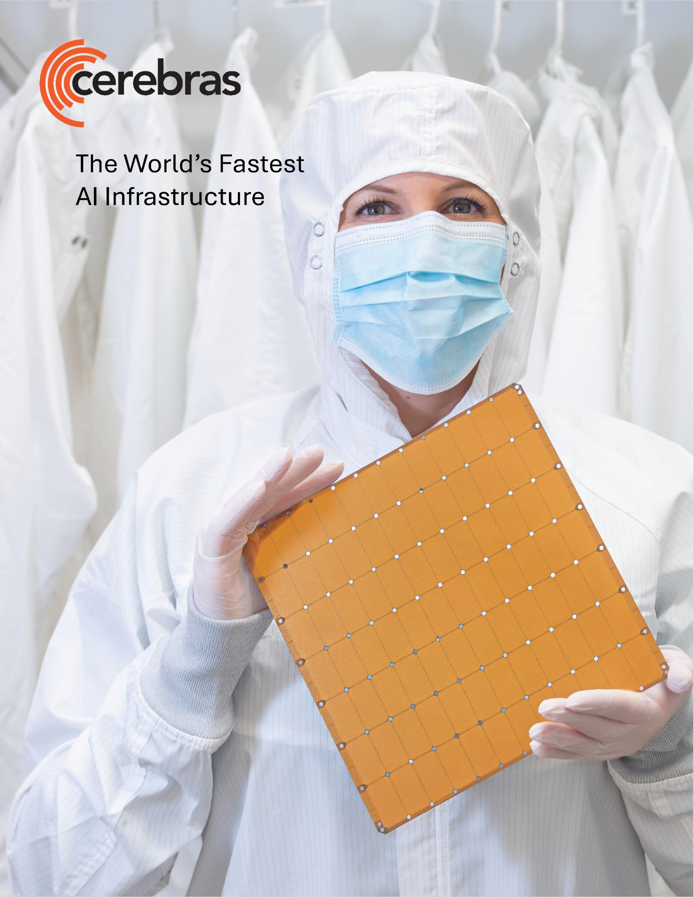

오늘 미국 시장에 상장 예정인 세레브라스(CBRS)는 꽤 낭만적인 회사다.

엔비디아를 시작으로 만들어진 AI 밸류체인이 모두 파티를 벌이고 있을 때, 엔비디아에 정면으로 대항하겠다고 나선 회사이기 때문이다.

첨부한 사진은 세레브라스의 상장 공시(S-1)에 첨부된 것이다. 들고 있는 저 하나가 하나의 칩이다. 그리고 이 칩은 이론상 엔비디아의 H100보다 약 7,000배 빠르다고 한다.

왜 이렇게 거대한 칩을 만들게 된 걸까? 그리고 왜 빠른 것인가?

AI가 엄청난 양의 연산을 한다는 것은 다 아는 사실이다. 그런데 이제 속도의 병목이 GPU 자체의 연산 속도에 있지 않다.

개인 컴퓨터에서는 보통 GPU를 한 장 붙여서 쓰지만, 클라우드 서버에서는 이걸 수천 개, 수만 개, 수십만 개를 연결해서 같이 쓴다.

한 대의 서버 컴퓨터 안에서 GPU와 GPU를 연결하고, 그 서버들끼리 연결하고, 그 서버를 쌓아 올린 '랙'끼리 연결하고, 더 나아가서는 그 랙들을 품고 있는 '데이터 센터'끼리도 연결하기에 이른다.

그래서 GPU와 GPU 사이에 엄청난 양의 데이터를 주고받게 되는데, 이 주고받는 과정에서 지연이 발생한다.

이 지연을 줄이기 위해 엔비디아는 NV-Link라는 기술도 개발하고, InfiniBand라는 기술도 만들었다.

그래도 부족하니까, 이제 서로 연결하는 '구리선'이 문제다, 이걸 '빛'으로 연결해야 한다며 광통신 회사에 엄청난 돈을 투자했다. (지난 3월에 코히어런트와 루멘텀에 6조를 투자하고, 며칠 전에는 광섬유를 만드는 코닝에 4.7조를 투자했다.)

GPU끼리의 연결도 문제지만, GPU와 '메모리' 사이의 통신도 빨라야 하니까 GPU 바로 옆에 속도가 빠른 DRAM을 붙이고, 그걸로 부족하니까 DRAM을 같은 자리에 차곡차곡 쌓아 올린다. (이게 지금 삼성전자와 SK하이닉스를 날아가게 만든 HBM이다.)

(간단하게 말해서) DRAM보다 더 빠른 게 SRAM이다. 그런데 이건 부피를 많이 차지하고 비싸다. GPU 옆자리는 아주아주 비싼 부동산이다. 어쩔 수 없이 SRAM은 작게 넣고, DRAM을 쌓은 HBM을 쓰고 있다.

여기서 세레브라스는 다른 생각을 한다. "그냥 칩을 크게 만들면 안 돼?"

SRAM 부피가 크면, 그냥 칩을 크게 만들어서 왕창 넣자. 그러면 HBM보다 빠르기도 하고, 서로 통신하는 시간도 줄잖아?

(이걸 보면서, 땅이 넓으니까 낮은 층으로 엄청 넓게 사옥을 지은 애플과 페이스북이 떠올랐다. 층간 이동이 직원들의 소통을 방해한다는 이유로 이렇게 했다고.)

그래서 세레브라스의 칩은 저렇게도 크고, 또 그렇게 빠른 것이다. (물론 엄청나게 비싸겠지.)

보통은 웨이퍼에 작은 칩들을 새겨 넣고 작게 잘라서 쓰는데, 세레브라스의 칩은 한 장의 웨이퍼가 칩 하나다. 자르지 않는다.

그런데 문제가 있다. '수율은 어쩔 건데?'

보통은 웨이퍼 한 장에 만들어진 수많은 칩들을 잘라서 쓴다고 했는데, 나오는 걸 다 쓸 수 있는 게 아니다. 그 안에 항상 일부 불량이 나오고, 그건 버린다.

세레브라스의 칩은 웨이퍼 한 장이 하나의 칩이니까… 그중에 불량인 영역이 조금이라도 있으면 칩 하나를 통째로 버려야 하고, 수율이 극악이 된다.

세레브라스는 이걸 소프트웨어로 해결했다. 90만 개의 코어 중 일부가 제조 과정에서 고장 나더라도, 소프트웨어가 고장 난 코어를 피해 데이터를 전송하도록 설계한 것이다.

매출도 급성장했다.

2025년 전체 매출은 5억 1,000만 달러를 기록하여, 2024년(2억 9,030만 달러) 대비 76% 급성장한 것이다.

와. 너무 매력적이다. 제2의 엔비디아가 나온 것 아닌가! 하지만 세상은 그리 만만하지 않다.

매출은 성장 중이지만, 여전히 엄청난 폭의 적자를 보고 있다.

그리고 매출의 86%가 아랍 쪽 고객 2곳에서 나오고 있어서 편중이 너무 심하다.

그리고 상장가가 이미 엄청나게 고평가되어 있다. 상장 주가가 '매출' 대비 무려 95배에서 시작한다. 이익 대비(PER)가 아니라 매출 대비다.

그리고 엔비디아도 가만히 있지 않다. 작년 12월에 비슷한 컨셉으로 SRAM 기반 칩을 설계하는 Groq에 29조를 내고 우회 인수했다.

제일 큰 문제는, 엔비디아가 가진 CUDA의 존재다.

GPU를 사면 그냥 돌아가는 게 아니고, 모델이 GPU에 접근할 수 있게 만드는 소프트웨어 플랫폼이 필요한데, 엔비디아 GPU의 플랫폼이 CUDA다.

전 세계 연구자들도, 개발자들도, 데이터 엔지니어들도 다 CUDA를 배우고 쓰고 있다. 세레브라스 칩을 쓰려면, 새로운 소프트웨어를 익혀야 하고, 기존에 쓰던 것들을 다시 만들어야 한다.

AI 인프라는 이미 '칩' 싸움이 아니라 '생태계' 싸움이라는 점에서, 세레브라스는 아주 힘든 경쟁을 앞두고 있는 것이다.

승산은 거의 없어 보인다. 하지만 지금 미국의 빅테크들은 모두 이 '승산 없는 싸움'을 이긴 한때의 다윗이었다는 점에서, 쉽게 결론을 내리긴 어렵다.

새로운 도전을 흥미롭게 지켜보면서, SRAM 기반의 칩이 어떻게 또 혁신을 만들어낼지 지켜봐야겠다. (과연, 엄청난 고평가로 시작하는데도 상승 마감할 수 있는지도.)

이건 완전 망상급 상상이지만…

만약 세레브라스가 성공적으로 상장하고, 여기서 'SRAM 기반 칩' 내러티브가 형성되면, 삼성전자와 SK하이닉스 주가가 타격을 입을 수 있지 않을까?

현실적으로는 HBM은 앞으로도 엄청 부족하겠지만, 'SRAM이 훨씬 빠르대! 이제 HBM은 위기야!'라는 내러티브는 너무 흥미롭기 때문에, 지난 딥시크 쇼크나 터보퀀트 쇼크 같은 상황이 올 수도 있지 않을까 하는 생각.

(참고로 세레브라스 칩은 TSMC 파운드리에서만 생산이 가능하다.)
