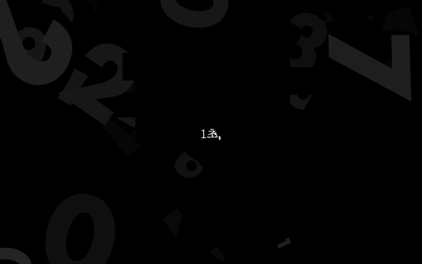
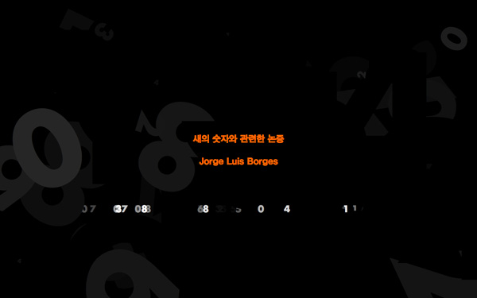

보르헤스의 단편선 '칼잡이들의 이야기'에 수록된 '새의 숫자와 관련한 논증'을 코드를 통해 영상으로 재현. [프로세싱](http://www.processing.org)으로 제작.

Original text by Jorge Luis Borges.

Built with [Processing](http://www.processing.org).

2009.

[Download - Mac OS X](http://limitist.cafe24.com/portfolio/src/numberOfBirds/numberOfBirds_macosx.zip)

[Download - Windows](http://limitist.cafe24.com/portfolio/src/numberOfBirds/numberOfBirds_windows.zip)

