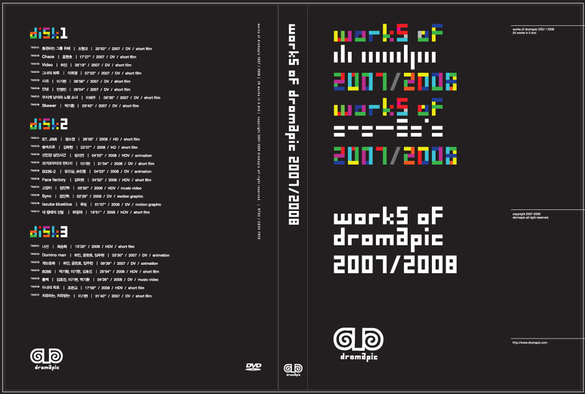
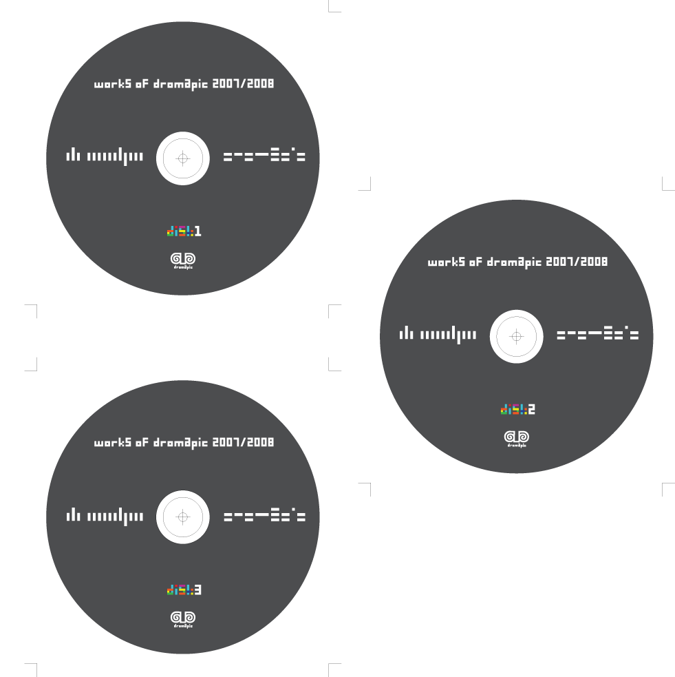
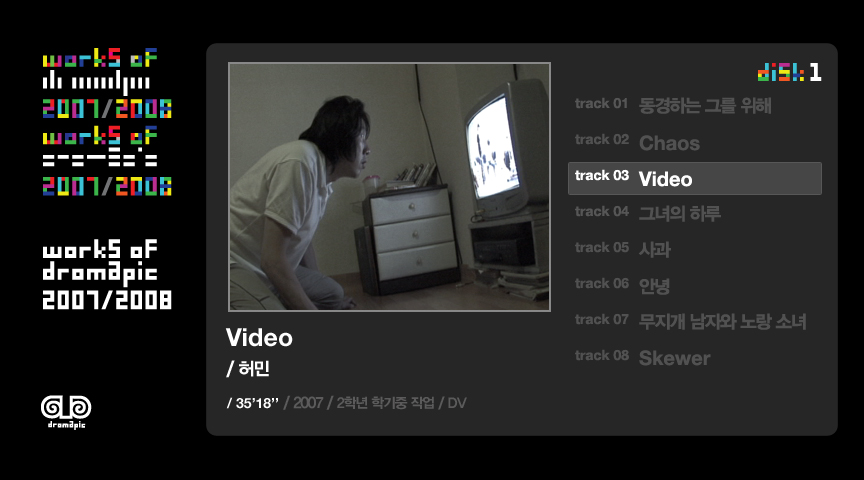

홍익대학교 시각디자인과 영상소모임 '드로마픽'의 07/08년 작품을 모은 DVD 전반을 디자인한 프로젝트. 드로마픽 로고 내 타입과 영상의 시작을 알리는 컬러바의 색상을 결합하여 DVD케이스의 주요 테마로 삼고, 디스크 디자인과 DVD내 GUI디자인, 영상 수합 및 인코딩까지 통합적으로 진행.

'Dromapic' is a group that studies about and makes film and animation at Hong-ik University. This DVD contains the works made by Dromapic for two years.

2008.

: :Cover

: :Disk Design

: :Navigation GUI

: :Navigation GUI

: :Navigation GUI
