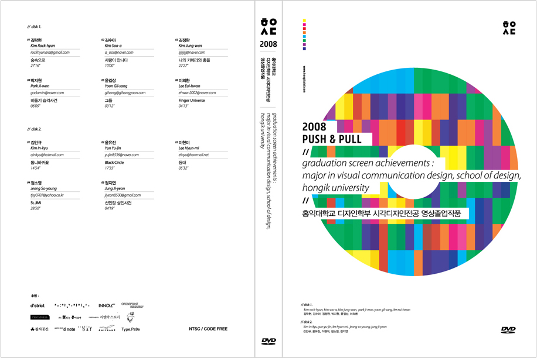
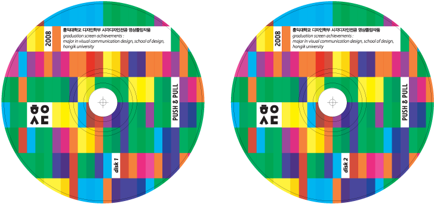
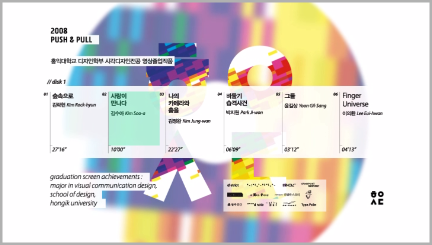
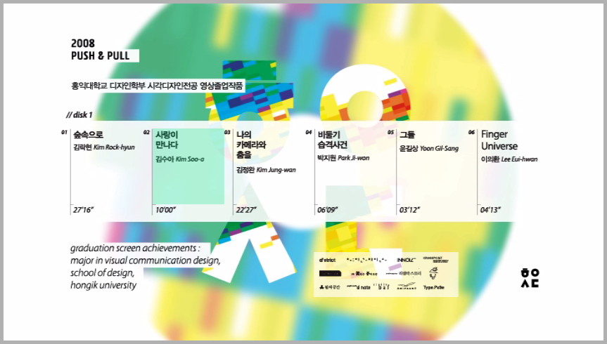

홍익대학교 시각디자인과 2008년도 영상파트 졸업작품을 모은 DVD의 케이스, 디스크, 내부 GUI디자인. 해당 연도의 [포스터 이미지](http://choihyemi.com/indexhibit/index.php?/projects/graduation-exhibition-poster-2008/)를 재해석하여 컨셉을 수립하였다.

2008.

Designing cover, disk, brochure, navigation GUI for DVD which contains graduation works of students of Hong-ik University. (Visual Communication Design Department) based on the [poster](http://choihyemi.com/indexhibit/index.php?/projects/graduation-exhibition-poster-2008/) of the exhibition.

2008.

: :DVD cover

: :disk design

: :Navigation GUI

: :Navigation GUI
