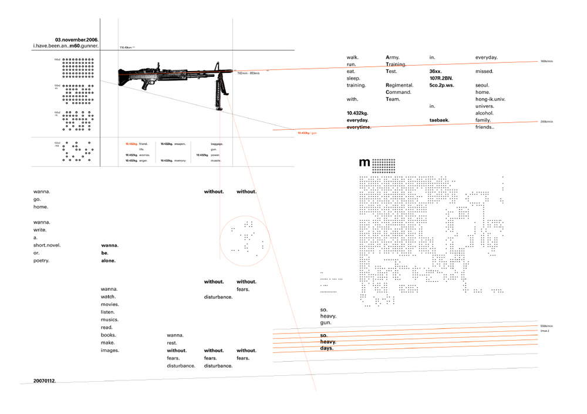

상병 초기, 휴가를 나와 진행한 포스터 작업. 휴가 나오기 얼마 전, 나는 M60 기관총 사수가 되었다. 군생활에서 느꼈던 외로움과 그리움, 그리고 기관총만큼이나 무거웠던 감정들을 모아 포스터로 만들었다.

I made this work when I'm in the military. I had been a M60 machine gunner.. and that time was so- tough. I felt sad and lonely and missed family and friends every minute. This work is a reflection of those emotion.

2007.

