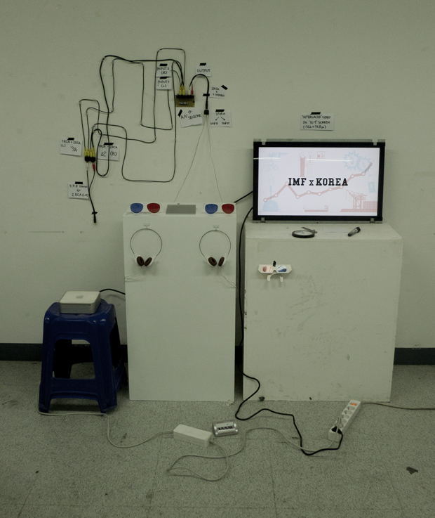
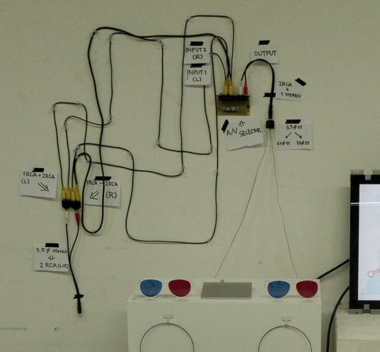
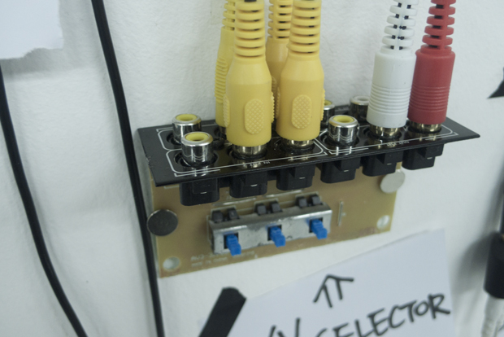
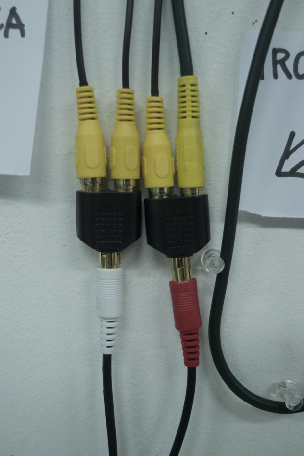
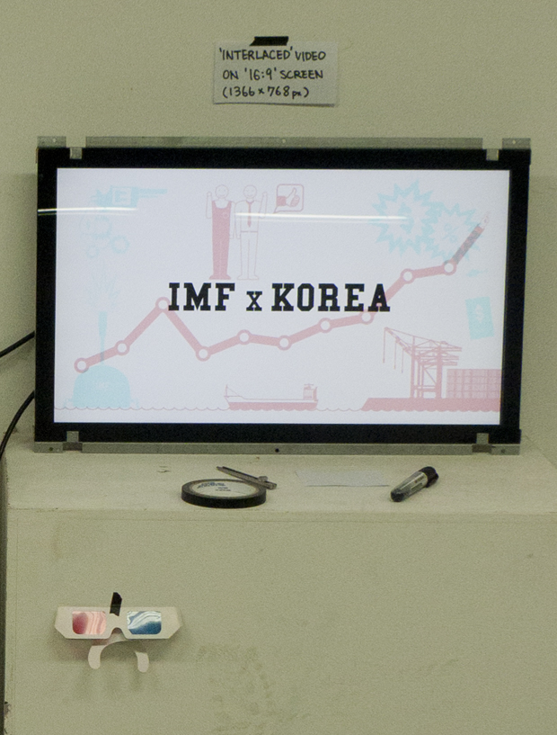

[Go to process archive blog](http://limitist-grad.tumblr.com/)

처음 경제에 관한 주제를 선택하게 된 것은 신문의 경제면을 채우는 공감할 수 없는 경제 지표들 때문이었다. 주가도 오르고, 성장률도 회복하고, 수출도 최고기록을 계속 경신하는데 왜 사람들의 삶은 나아지지 않는 것인지 의문이 들었다. 한국에도 분명 호경기가 있었는데, 어느 지점부터 현재까지 오랜 불경기를 겪고 있다는 생각이 들었고, 경기의 흐름을 되짚던 중, 이른바 'IMF시대'라는 큰 분기점을 발견했다. 그 때 많은 사람들의 경제적인 삶이 무너졌고, IMF의 관리를 벗어난 후에도 그들의 삶은 여전히 회복되지 않고 있는 것 같았다. 이 시간동안 무슨 일이 있었는지, 당시 경제 위기는 왜 찾아온 것인지, 그리고 IMF라는 단체와 그들의 정책은 무엇인지 리서치를 시작했고, 그 과정에서 IMF와 한국을 바라보는 양분화된 시선이 있음을 발견했다. 누군가는 IMF를 세계 경제의 수호자로 보고, 97년 한국 경제 위기의 원인은 한국 경제의 취약한 구조에 있다고 말한다. 또 다른 이들은 IMF가 미국과 선진국들을 위해 움직이는 경제적 악의 축이라 주장하며 한국은 이들에게 경제적 침공을 당한 피해자라고 말한다.

한국과 IMF에 대해 이야기 하는 영상을 만들되, 이러한 극단적인 두 개의 시선을 효과적으로 시각화 할 수 있는 방법에 대해 생각해보았다. 두 가지 시선을 담은 두 개의 영상을 만들고 두 개의 스크린을 통해서, 혹은 교차 편집을 통해서 보여주는 것이 가장 일반적인 방식이었지만, '체험'을 동반한 영상을 만들어 '두 개의 시선'이라는 컨셉을 강화하고 싶었다. 그 때, 방안을 굴러다니던 종이로 된 3D안경을 발견했다. 한 쪽은 빨간색, 다른 한 쪽은 청색 셀로판지가 붙어있는 안경이었다. 빨간쪽으로 보면 빨간색(#FF0000)이 안보이고, 파란쪽으로 보면 파란색(#00FFFF)이 안보이는 것을 확인하고, 이 두 가지 색으로만 영상을 만들고 안경을 통해 필터링 할 수 있겠다는 생각을 했다. 왼쪽, 혹은 오른쪽 - 어느 쪽 눈을 뜨는가에 따라 전혀 다른 시각의 영상을 보게 된다는 것. 이 두개의 영상을 하나로 합치기 위해 영상의 픽셀 단위를 생각해 보았고, 인터레이스 방식에서 아이디어를 얻게 되었다. 인터레이스 방식은 처음 TV가 등장했을 때, 발신량의 한계로 인해 한 화면을 홀수 번째 선과 짝수 번째 선으로 나누어 두 번씩 전송하던 것을 말한다. 이 방식을 사용하여 한 영상은 홀수 번째 선에만, 다른 영상은 짝수 번째 선에만 보이게 하면 서로의 영역에 침범하지 않고 고유의 화면을 주사할 수 있었다. 빨간 렌즈로 보면 파란 영상만 보이고, 파란 렌즈로 보면 빨간 영상만 보이는 특수 영상은 이렇게 탄생했다. 이 두 영상은 같은 타임라인을 공유하며 두 개의 시선을 시각화 했고, 관람자는 한 쪽 눈을 감거나 가림으로써, 물리적으로 시선을 선택하는 경험을 하게 된다.

두 개의 다른 영상에 따라 사운드 역시 두 개로 나뉘어져야 했다. 각각의 영상에 맞는 BGM과 효과음, 나래이션을 통해 두 가지 사운드를 디자인했다. 그리고 이에 대한 선택권을 주기로 하고, 이를 위해 처음에는 이어폰을 이용하여 왼쪽, 오른쪽 이어폰에서 각각 다른 소리가 나도록 계획하였다. 하지만 전시장이 매우 혼잡하고 시끄러울 것을 고려하니, 한 쪽 이어폰으로만 소리를 듣는 것이 다소 무리가 될 것이라고 판단하고, 사운드를 선택할 수 있는 버튼을 설치하여 그것을 눌러가며 소리를 선택하도록 하였다. 그러려면 영상을 인코딩 할 때 사운드를 두 개의 채널로 나누고 이를 선택할 수 있는 셀렉터를 설치해야 했는데, 그 과정이 매우 복잡하고 셀렉터의 가격도 매우 비쌌다. 고민하다가 용산을 직접 찾아가 이러한 장비에 대해 물어보고 다녔는데, 대부분의 가게들에서 차가운 무시를 당했지만, 한 가게에서 매우 촌스러운 외관의 차량용 AV셀렉터를 추천 받았고, 그 것을 중심으로 다양한 케이블들을 사모으며 문제를 해결해 나갔다. 결론적으로 이를 구현한 방식은 이러하다. 1)영상 인코딩 시, 두개의 사운드를 MONO로 변환하고, 이를 L/R에 각각 배치한 후, STEREO로 인코딩한다. 2)컴퓨터의 영상 출력단자(3.5mm 스테레오 잭)에 '스테레오(수)-2RCA(암) 젠더'를 꽂아 L/R을 물리적으로 분리한다. 3)분리된 두 개의 RCA 구멍에 '1RCA(수)-2RCA(암) 젠더'를 꽂아 L/R 각각의 사운드를 다시 두 선으로 불린다. 이렇게 되면 L쪽 두 개, R쪽 두 개 - 총 4개의 RCA 구멍이 생긴다. 4)이 중 L쪽 두 개의 선은 셀렉터의 1번 Input에 연결하고, R쪽 두 개의 선은 2번 Input에 연결한다. (내가 산 셀렉터는 총 3개의 Input을 받을 수 있었다) 그리고 Output 단자를 헤드폰에 연결한다. 5)이렇게 설치하면 1번 버튼을 누르면 L쪽 사운드를, 2번 버튼을 누르면 R쪽 사운드가 헤드폰을 통해서 나온다.

마지막으로 준비한 장비는 안경이었다. 종이안경을 그대로 쓰려 했으나, 쓰기가 불편한 문제가 있어, 적청3D안경을 들고 안경점에 찾아가 테를 고른 후 이 안경과 똑같은 색의 렌즈를 맞추어 달라고 주문했다. 주인은 상당히 의아해 했으나 '전시용품'이라는 말을 듣고 수락하였으며, 나중에는 재수정까지 해주는 적극적인 협조를 해주었다.

이런 과정을 통해 영상과 장비들이 준비되었고, 전시장에서 나의 영상은 벽에 걸린 스크린에서 나오고, 그 앞에 놓여진 테이블 위에 두 개의 특수 안경과 두 개의 헤드폰, 하나의 사운드 셀렉터(외관이 매우 조잡하여 케이스를 뜯은 채로 사용하였다), 하나의 트랙패드(영상의 타임라인 선택용)를 설치하였다.

