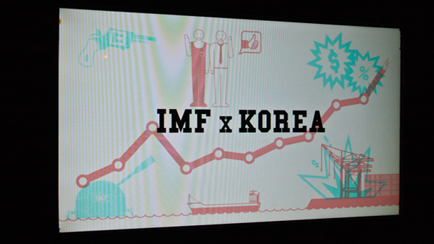
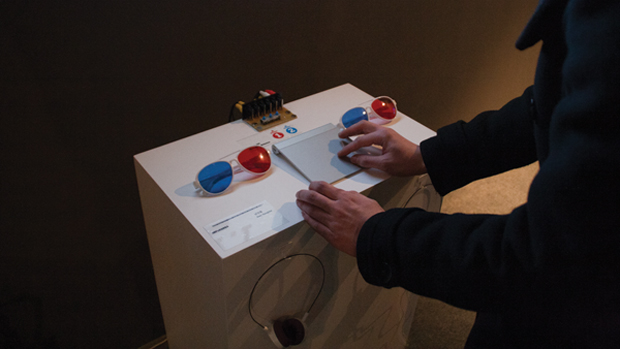
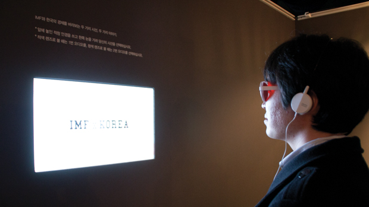
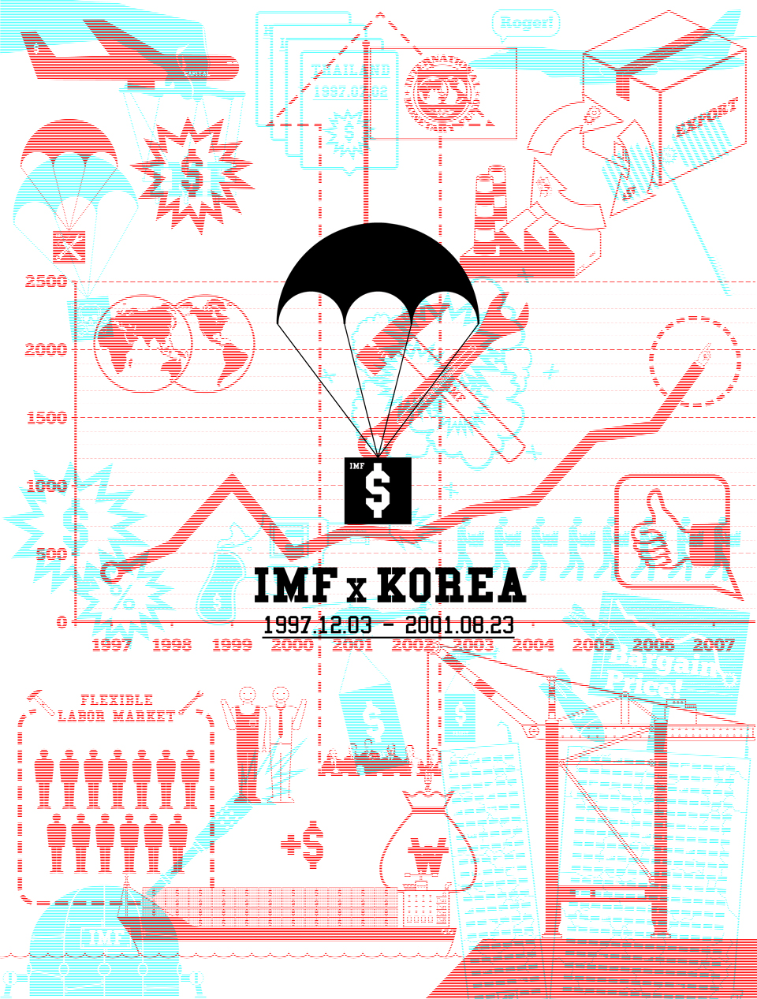

한국에서 IMF라는 이름은 경제적 위기와 공포를 뜻한다. 1997년 10월에 시작된 외환위기와 그로 인해 찾아온 1997년 12월 3일부터 2001년 8월 23일까지의 IMF관리체제, 그리고 이 시간을 가득 채운 불경기, 부도, 대량해고, 생존위기와 같은 단어들 때문이다. 한국은 그 어느 나라보다도 빠르게 회복하여 IMF체제를 조기 졸업하며 또 하나의 신화를 쓰는 듯 했지만, 정작 IMF가 무엇인지, 이른바 IMF시대 동안 무슨일이 일어난 것인지 제대로 돌아보지 못했다.

이를 살펴보기 위해 IMF와 한국의 IMF시대에 대한 상반되는 두 가지 시선을 보여주는 두 개의 애니메이션을 만들었다. 그리고 이를 인터레이스 방식을 통해 하나의 화면으로 합쳤다. 관람자는 이 화면 앞에서 적청안경과 이어폰을 쓰고 시선을 선택해야 한다. 왼쪽 눈으로 볼 것인가, 오른쪽 눈을 뜰 것인가. 선택에 따라 전혀 다른 이야기를 듣고 보게 된다.

연출 / 그래픽 디자인 / 애니메이션 : 남영철

사운드 디자인 : 허진채

녹음 : 사운드 파크

성우 : 김영우

음악 : Oleg Bobkov - Colours / OG - Wax / Alexander Blu - Electricity

2010.

In South Korea, the word 'IMF' means economic crisis and fear (rather than the organization of the world), because of the painful memories of financial crisis in September 1997 and the severe control of IMF from 1997-2001. After the crisis, South Korea recovered rapidly and finished the IMF control system earlier than any other countries. However, Korean didn't have the chance to look back the time and think about what IMF really meant.

To make people understand IMF and their policy, I made two animations show two conflicting opinions and combine them into one screen by 'interlace method'. Spectators should put on 'red-cyan glasses(a kind of 3D glasses)' and earphones, then they should choose one point of view - left eye and ear, or right eye and ear. According to choice, they will see and hear completely different story about IMF.

Director / Graphic design / Animation : Nam Young-chul

Sound design : Huh Jin-chae

Sound recording : Sound Park

Voice actor : Kim Yeong-woo

BGM : Oleg Bobkov - Colours / OG - Wax / Alexander Blu - Electricity

2010.

mixed picture on screen

2 RED-CYAN glasses + 2 Headphone + Narration Selector + Trackpad

Spectator with glasses and headphone

<iframe src="https://player.vimeo.com/video/17610931" width="640" height="360" frameborder="0" allow="autoplay; fullscreen; picture-in-picture" allowfullscreen></iframe>

<iframe src="https://player.vimeo.com/video/17610421" width="640" height="360" frameborder="0" allow="autoplay; fullscreen; picture-in-picture" allowfullscreen></iframe>

